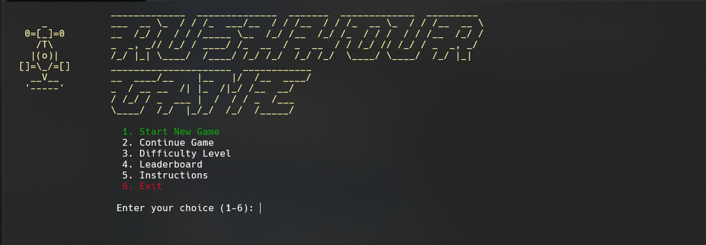
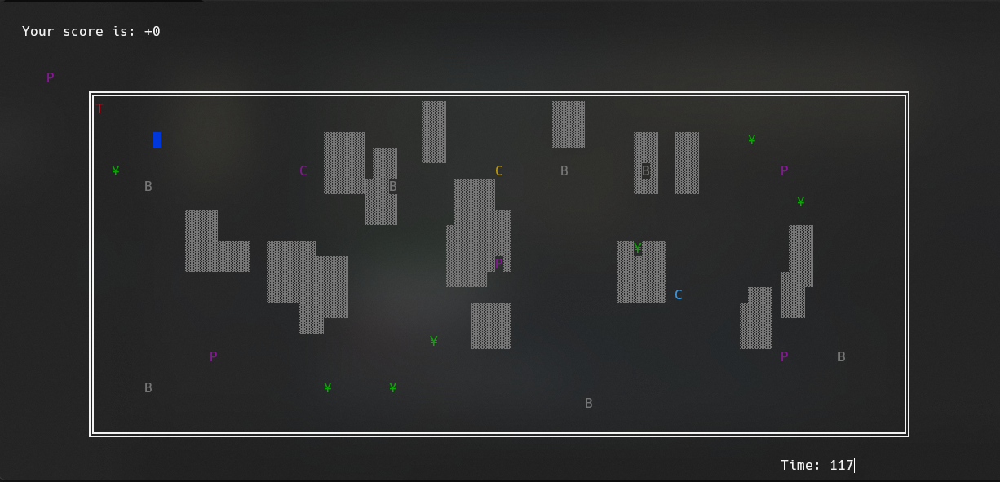

# 🚖 Rush Hour Taxi

A fun taxi driving game built entirely in **x86 Assembly** using **MASM** and the **Irvine32 library**.

## 🎮 Quick Start

### What You Need:
- **Visual Studio** (2019 or newer recommended)
- **MASM** (Microsoft Macro Assembler) - included with VS
- **Irvine32 Library** (already in the solution)

### How to Play:
1. **Start the game** → Choose your taxi (Red/Yellow/Random)
2. **Enter your name** → Up to 19 characters
3. **Pick a game mode** → Career, Time, or Endless
4. **Drive!** → Use arrow keys to move, Spacebar to pick up/drop off passengers

## 🕹️ Controls
- **Arrow Keys** → Move your taxi
- **Spacebar** → Pick up/Drop off passengers
- **P** → Pause the game
- **S** → Save score (while paused)
- **Q** → Quit to menu (while paused)

## 💾 Installation (Visual Studio Solution)

1. Open **Visual Studio**
2. Go to **File → Open → Project/Solution**
3. Navigate to the project folder and open `.sln`
4. Press **F5** to build and run

## 🏆 Features
- Three game modes
- Two taxi types with different characteristics
- NPC traffic
- Passenger delivery system
- Leaderboard with player names
- Dynamic city environment

## 📊 Scoring
- **+10 points** for delivering passengers
- **+10 points** for collecting bonus items
- Different penalties for Red vs Yellow taxi

## 🚗 Taxi Types
- **Red Taxi**: Slower, smaller penalties for hitting cars
- **Yellow Taxi**: Faster, smaller penalties for hitting obstacles

## 🎯 Objective
Drive through the city, pick up passengers, deliver them safely, and try to reach the top of the leaderboard!

---

*Made with MASM + Irvine32 in Visual Studio* 🚕💨